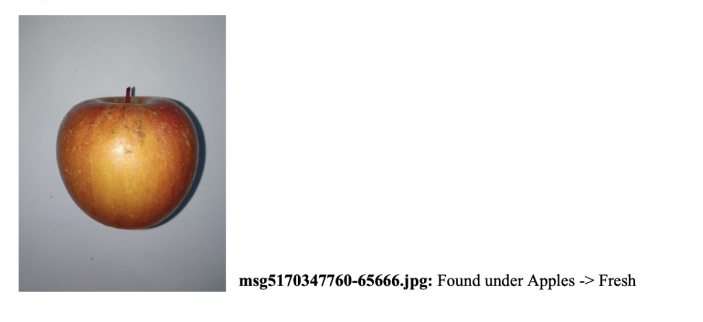
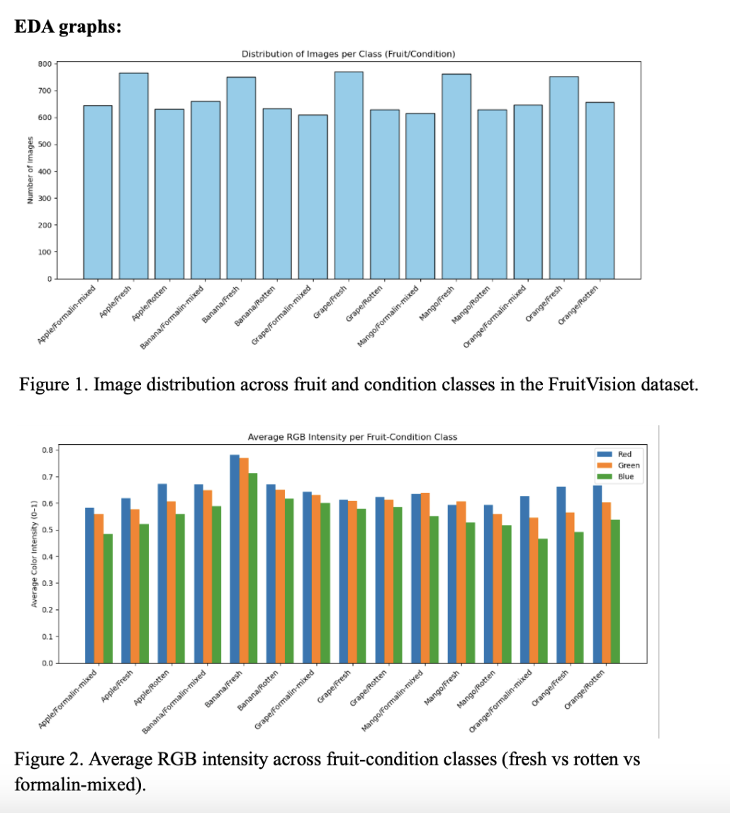

**Data Summary:**  
This dataset is compiled of about 10,000 images of fruits, specifically: oranges, apples, bananas, grapes and mangos [1]. Those images were then expanded to around 81,000 images as different angles of the fruits were used to build an augmented dataset. In the original dataset, images were classified as fresh, rotten or Formalin Mixed. As our goal is to examine just whether a model can identify fresh or rotten, we will likely not be using the Formalin Mixed categorized fruits. For classification, the original researchers worked with agriculture specialists to ensure the best quality classifications for the dataset.  
**Provenance:**   
The dataset comes as a part of a research project focused on using machine learning models to classify different fruits as fresh, rotten or Formalin Mixed. More information on the original research project to create the dataset can be found here: https://data.mendeley.com/datasets/xkbjx8959c/2  
**License:**   
This dataset is available for our use under the CC BY-NC-ND 4.0 license. This license is a Creative Commons license that permits the use of data, provided it is not for commercial purposes and credit is given to the original creators. As this project is not for commercial purposes, but for educational ones, this data is available for our use. Furthermore, we have ensured that we cite the original creators of the dataset in our references for all parts of this project.  
**Ethical Statement:**  
One thing we would like to note is the vagueness of the dataset in regards to species of fruit. While fruits are categorized as Apple, Banana, Orange, Mango or Grape, the specific type of each of those is unclear. With this knowledge, our model cannot be certain to be applied to all types of these fruits and we want to make note of that caveat.  
**Data Dictionary with image example:**  
The dataset is downloaded as image files which have been presorted by fruit. Within those file folders, each fruit then has a folder of fresh, rotten and formalin-mixed images. In each of those folders, the images of the fruits are labeled with a distinct number for each image.  
 
**EDA Plots:**
 
